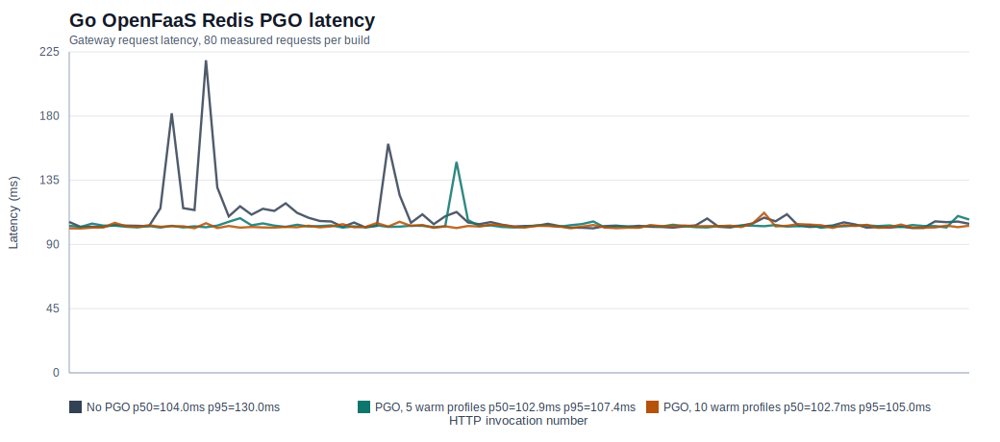
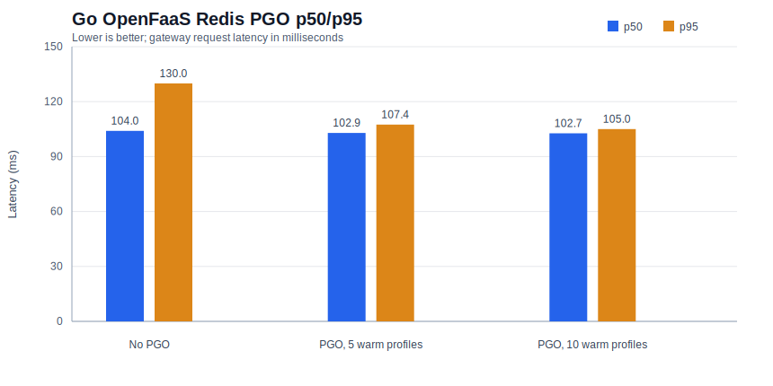
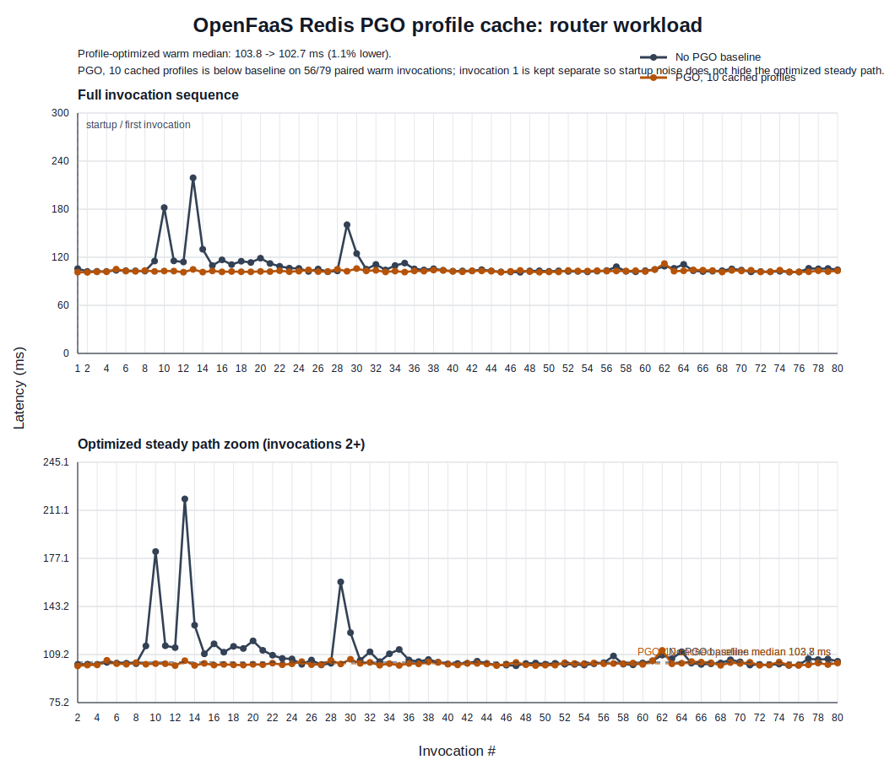

# Go OpenFaaS Redis PGO Results

Run ID: `20260511-171511`

Benchmark target: Go OpenFaaS function using Redis as the profile/cache state backend. The run compared a baseline build with no PGO against two PGO builds trained from warm-profile captures of 5 and 10 baseline invocations.

Environment notes:

- Local `kind` cluster with OpenFaaS gateway on `http://127.0.0.1:8080`.
- Redis deployed in `openfaas-fn`.
- Images were built locally and loaded into the `openfaas` kind cluster with
  `PUSH_IMAGE=0 KIND_CLUSTER=openfaas IMAGE_PREFIX=go-pgo-redis`, so no
  function image was pushed to an external registry.
- Function scaling was pinned to one replica before measurement to keep warm-profile capture deterministic.

## Summary

| Build | Requests | Mean ms | p50 ms | p95 ms | p99 ms | Max ms | Statuses |
| --- | ---: | ---: | ---: | ---: | ---: | ---: | --- |
| No PGO | 80 | 109.1 | 104.0 | 130.0 | 219.1 | 219.1 | `200: 80` |
| PGO, 5 warm profiles | 80 | 103.7 | 102.9 | 107.4 | 147.9 | 147.9 | `200: 80` |
| PGO, 10 warm profiles | 80 | 102.8 | 102.7 | 105.0 | 112.1 | 112.1 | `200: 80` |

Against the no-PGO baseline, the 10-profile PGO build improved mean latency by
about 5.7%, p50 by about 1.3%, and p95 by about 19.2%. The 5-profile PGO build
also improved the tail in this run: mean by about 4.9% and p95 by about 17.3%.

## DaCapo-Shaped Smoke Run

Run ID: `openfaas-dacapo-smoke`

Command shape:

```bash
BENCHMARKS="dacapo-lusearch dacapo-eclipse dacapo-h2" \
PROFILE_ITERS="1" PROFILE_SECONDS=3 PROFILE_LOAD_REQUESTS=5 \
MEASURE_REQUESTS=3 HANDLER_REQUESTS=10000 \
./scripts/06_run_go_openfaas_redis_pgo.sh
```

This was a smoke test of the full OpenFaaS Redis profile-cache loop across the
new Go-native DaCapo-shaped workloads. It verified baseline deployment, Redis
profile capture/fetch/store, profile merge, PGO image rebuild, kind image load,
redeploy, and post-PGO measurement for each workload.

| benchmark | build | requests | mean ms | p50 ms | p95 ms | statuses |
|---|---|---:|---:|---:|---:|---|
| dacapo-lusearch | No PGO | 3 | 7.927 | 6.937 | 10.197 | `200: 3` |
| dacapo-lusearch | PGO, 1 profile | 3 | 9.142 | 8.308 | 11.010 | `200: 3` |
| dacapo-eclipse | No PGO | 3 | 9.972 | 9.580 | 11.251 | `200: 3` |
| dacapo-eclipse | PGO, 1 profile | 3 | 10.108 | 9.619 | 11.464 | `200: 3` |
| dacapo-h2 | No PGO | 3 | 10.552 | 10.637 | 12.078 | `200: 3` |
| dacapo-h2 | PGO, 1 profile | 3 | 8.607 | 8.804 | 9.292 | `200: 3` |

The smoke run is intentionally too small for performance conclusions. Use larger
`MEASURE_REQUESTS`, `PROFILE_SECONDS`, and profile budgets for publishable data.

## Graphs





The clearest serverless-backed profile-optimization line graph is the split
view below. Profiles are captured from warm OpenFaaS baseline traffic, stored in
Redis, merged, imported into a rebuilt Go binary with `go build -pgo`, and then
redeployed through OpenFaaS. In this run the 10-profile PGO build is below the
baseline on 56/79 paired measured invocations after invocation 1, with a 1.1%
lower warm median and a much larger p95 improvement in the summary table above.



## Artifacts

- Raw benchmark outputs: `prototypes/go-openfaas-redis-pgo/.runs/20260511-171511/results`
- Captured warm profiles: `prototypes/go-openfaas-redis-pgo/.runs/20260511-171511/profiles`
- Combined summary: `docs/figures/go-openfaas-redis-pgo-summary.json`
- Plot generator: `prototypes/go-openfaas-redis-pgo/plot_openfaas_results.py`
