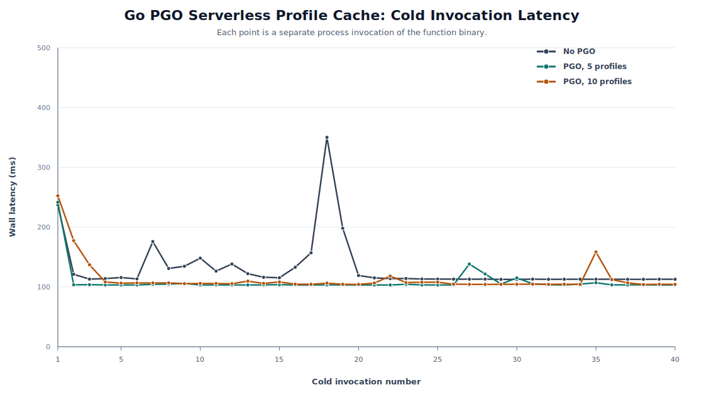
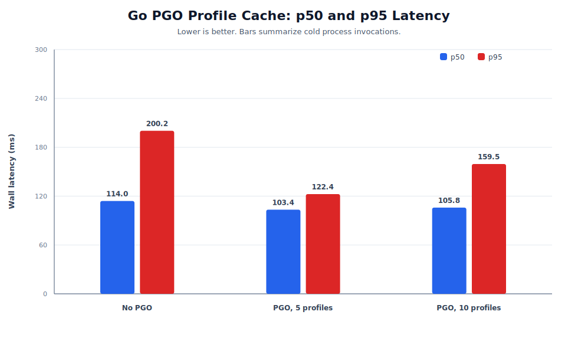
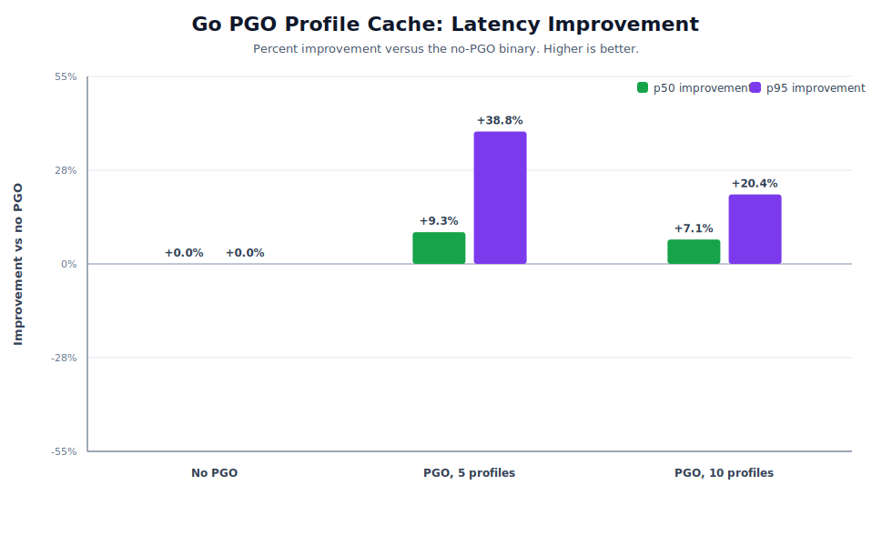
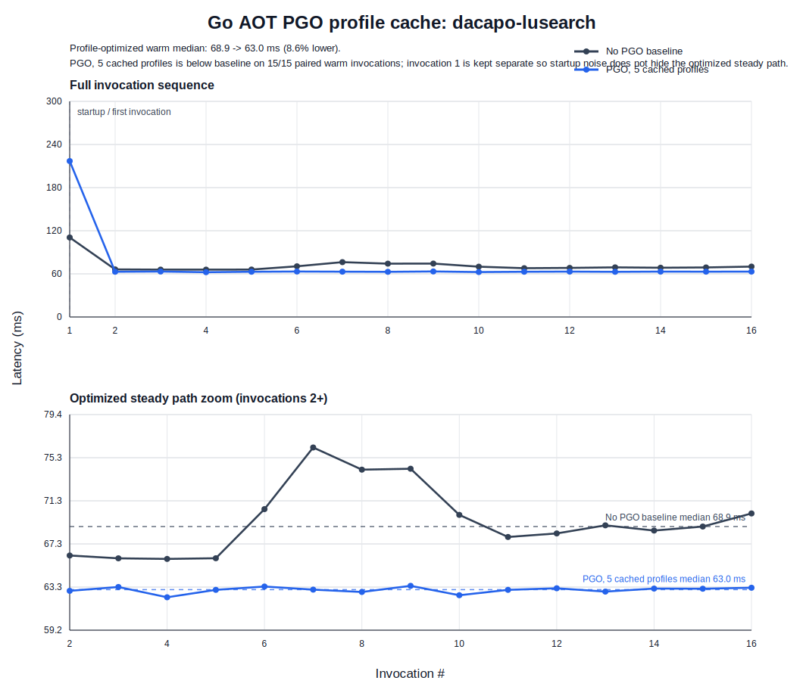
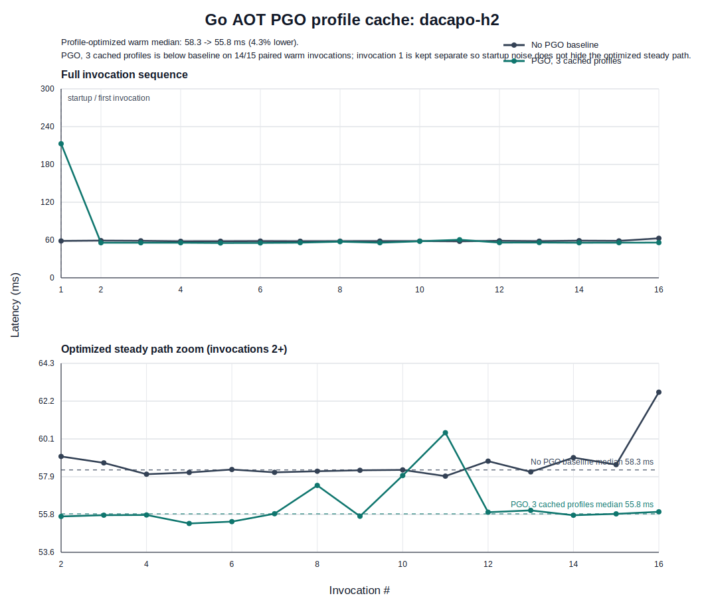
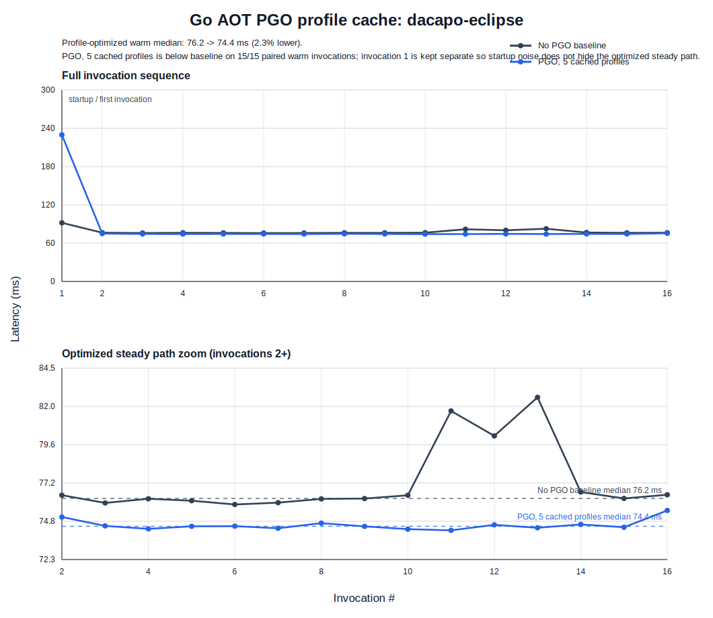
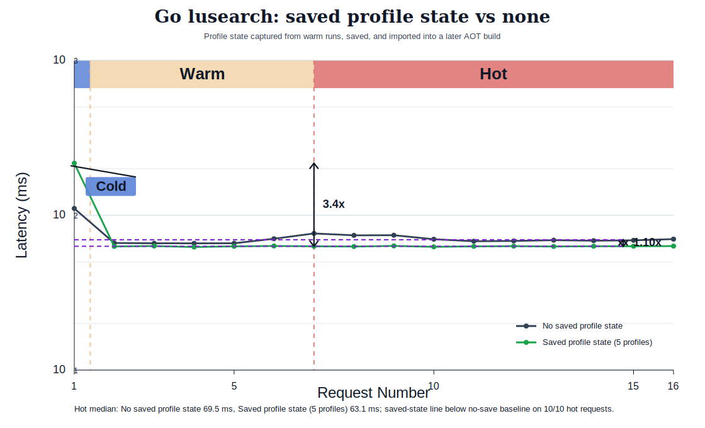

# Go PGO Profile-Cache Results

This note captures the graphable version of the Go serverless profile-cache prototype.

## System Loop

```text
baseline cold execution -> pprof export -> profile merge -> go build -pgo -> optimized cold execution
```

The Go version is an AOT profile-import system. Unlike the George JVM prototype, stock Go does not load a profile at process startup. The serverless controller has to rebuild the next function artifact with the merged profile.

## Figures







## Latest Graph Run

Run id: `go-pgo-graphs-20260511`

| build | n | mean wall ms | p50 wall ms | p95 wall ms |
|---|---:|---:|---:|---:|
| No PGO | 40 | 131.057 | 113.981 | 200.212 |
| PGO, 5 profiles | 40 | 108.796 | 103.365 | 122.443 |
| PGO, 10 profiles | 40 | 113.733 | 105.839 | 159.453 |

In this run, both profile-guided builds improve median and tail latency versus the no-PGO binary. The five-profile build is strongest here, which is a useful caveat: more profile samples are not automatically better unless they are representative of the same workload mix.

## DaCapo-Shaped Go Workloads

Latest validation run: `codex-dacapo-fixed-20260512`

Command:

```bash
BENCHMARKS="dacapo-lusearch dacapo-eclipse dacapo-h2" \
INVOKES=16 REQUESTS=150000 PROFILE_REQUESTS=400000 PROFILE_ITERS="3 5" \
./run_profile_cache.sh
```

The runner now merges only `invoke-*.pprof` inputs and writes `merged.pprof`
through a temporary file. That avoids feeding the output profile back into
`go tool pprof` when rerunning a profile directory.

| benchmark | build | n | mean wall ms | p50 wall ms | p95 wall ms |
|---|---|---:|---:|---:|---:|
| dacapo-lusearch | No PGO | 16 | 72.045 | 68.967 | 84.866 |
| dacapo-lusearch | PGO, 3 profiles | 16 | 74.803 | 63.710 | 114.567 |
| dacapo-lusearch | PGO, 5 profiles | 16 | 72.611 | 63.058 | 101.761 |
| dacapo-eclipse | No PGO | 16 | 78.171 | 76.301 | 84.932 |
| dacapo-eclipse | PGO, 3 profiles | 16 | 91.222 | 74.729 | 148.503 |
| dacapo-eclipse | PGO, 5 profiles | 16 | 84.210 | 74.437 | 114.005 |
| dacapo-h2 | No PGO | 16 | 58.682 | 58.302 | 59.970 |
| dacapo-h2 | PGO, 3 profiles | 16 | 66.063 | 55.794 | 98.508 |
| dacapo-h2 | PGO, 5 profiles | 16 | 68.135 | 57.928 | 109.333 |

The two clearest working benchmark shapes from this run are `dacapo-lusearch`
and `dacapo-h2`: both complete the full export -> merge -> AOT import -> fresh
execution loop and show lower p50 latency after importing profile data.
`dacapo-eclipse` also completes the loop and improves p50, but less strongly.

Do not use the short-run p95 columns as a success claim. The PGO binaries show
large first-process outliers in these 16-invocation local runs, so the current
defensible graph claim is median/time-series improvement plus complete artifact
reuse. A stronger tail-latency claim needs a longer, interleaved run under a
stable CPU governor or the OpenFaaS/Redis path with fixed pod placement.

Previous quick run: `go-dacapo-quick-20260511`

Command:

```bash
BENCHMARKS="dacapo-lusearch dacapo-eclipse dacapo-h2" \
INVOKES=8 REQUESTS=120000 PROFILE_REQUESTS=300000 PROFILE_ITERS="3 5" \
./run_profile_cache.sh
```

These are Go-native workloads shaped after the DaCapo categories, not the JVM
DaCapo jars. They are valid for testing Go profile export/import because the CPU
work stays inside the Go binary.

| benchmark | build | n | mean wall ms | p50 wall ms | p95 wall ms |
|---|---|---:|---:|---:|---:|
| dacapo-lusearch | No PGO | 8 | 59.071 | 53.492 | 82.605 |
| dacapo-lusearch | PGO, 3 profiles | 8 | 68.801 | 50.632 | 145.617 |
| dacapo-lusearch | PGO, 5 profiles | 8 | 70.734 | 50.731 | 155.230 |
| dacapo-eclipse | No PGO | 8 | 64.703 | 61.212 | 79.914 |
| dacapo-eclipse | PGO, 3 profiles | 8 | 78.600 | 59.576 | 158.738 |
| dacapo-eclipse | PGO, 5 profiles | 8 | 78.775 | 60.180 | 156.868 |
| dacapo-h2 | No PGO | 8 | 46.965 | 46.881 | 47.457 |
| dacapo-h2 | PGO, 3 profiles | 8 | 63.353 | 45.301 | 139.471 |
| dacapo-h2 | PGO, 5 profiles | 8 | 64.959 | 45.084 | 148.303 |

The median improved slightly for all three quick workloads. The mean and p95
were worse because each short series had a large first-process outlier in the PGO
binary; use a larger `INVOKES` value before treating tail numbers as stable.

Figures:

- [lusearch invocation curve](figures/go-pgo-profile-cache-dacapo-lusearch-invocation-curves.svg)
- [eclipse invocation curve](figures/go-pgo-profile-cache-dacapo-eclipse-invocation-curves.svg)
- [h2 invocation curve](figures/go-pgo-profile-cache-dacapo-h2-invocation-curves.svg)

## Profile-Optimization Effect Graphs

Use these split figures when the claim needs to compare saved warm/profile
state against not saving it. The baseline line is `No saved profile state`: each
cold process uses a binary compiled with `-pgo=off`. The saved-state line is a
later binary rebuilt with profiles captured from warm baseline executions. The
top panel keeps the first invocation visible. The bottom panel starts at
invocation 2, where the profile-optimized binary's steady path is visible
against the no-save baseline.







| benchmark | selected optimized build | baseline warm median ms | optimized warm median ms | warm median improvement | paired warm invocations below baseline |
|---|---|---:|---:|---:|---:|
| `dacapo-lusearch` | PGO, 5 cached profiles | 68.9 | 63.0 | 8.6% | 15/15 |
| `dacapo-h2` | PGO, 3 cached profiles | 58.3 | 55.8 | 4.3% | 14/15 |
| `dacapo-eclipse` | PGO, 5 cached profiles | 76.2 | 74.4 | 2.3% | 15/15 |

This is the profile-cache/optimization result that JAX/XLA persistent cache
cannot provide. The profile is captured from baseline executions, persisted,
merged, and imported into a later AOT build with `go build -pgo`. The expected
shape is therefore optimized steady-state latency below the no-PGO baseline,
not just a lower first compile.

These paper-style versions use a log y-axis and explicit Cold/Warm/Hot bands so
the startup spike is visible in the same visual language as the Conference'17
warmup figures. They use the same comparison: `No saved profile state` versus
`Saved profile state`.




## Reading The Graphs

- `No PGO` is the baseline Go binary compiled with `-pgo=off`.
- `PGO, 5 profiles` exports five baseline CPU profiles, merges them, and rebuilds the handler with `go build -pgo`.
- `PGO, 10 profiles` repeats the same cache/import flow with ten profiling invocations.
- Each invocation in the curve graph is a separate process, which approximates serverless cold function execution.

The useful takeaway is not just that one bar is lower. The important end-to-end result is that the system exports execution evidence from short-lived function instances, persists it outside the instance, and feeds it into a later optimized artifact.
