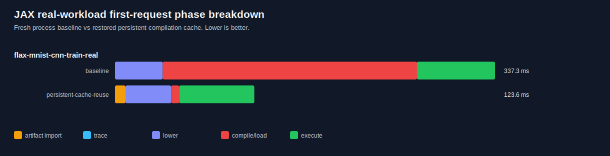
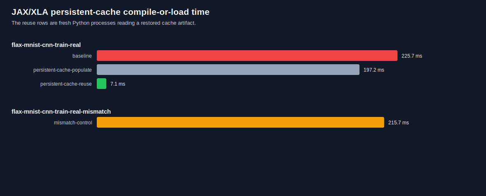
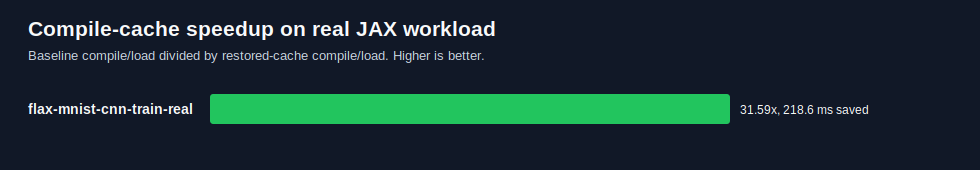

# JAX Real-Workload Persistent Cache Results

Run ID: `20260526-171021`

This run replaces the DaCapo-shaped JAX signatures with a self-contained
TORAX-style transport miniapp in `prototypes/jax-real-workload-cache`.

The measured path is:

```text
scenario/config profile
  -> JAX lower/compile
  -> JAX persistent compilation cache
  -> compressed local object-store artifact
  -> restore artifact at the same cache mount path
  -> fresh-process compile/load reuse
```

The same cache path requirement is intentional. It mirrors an OpenFaaS pod
mount such as `/profiles/jax-cache`; with the current JAX release, restoring to
a different path can miss even when the files are present.

Command:

```bash
TRIALS=2 EXECUTIONS=1 bash prototypes/jax-real-workload-cache/run_jax_real_workload_cache.sh
```

Raw outputs:

```text
prototypes/jax-real-workload-cache/results/20260526-171021/
prototypes/jax-real-workload-cache/artifacts/20260526-171021/
```

Figures:







## Summary

| Scenario | Baseline compile/load p50 | Restored-cache compile/load p50 | Compile/load speedup | First-request p50 baseline -> cache |
| --- | ---: | ---: | ---: | ---: |
| `torax-pulse-64` | 227.7 ms | 22.7 ms | 10.01x | 289.8 ms -> 72.9 ms |
| `torax-mlsurrogate-64` | 186.6 ms | 23.9 ms | 7.81x | 229.5 ms -> 66.3 ms |

Artifact overhead:

| Metric | Value |
| --- | ---: |
| Restored cache files | 3 |
| Cache bytes on disk | 131,090 bytes |
| Compressed artifact | 130,135 bytes |
| Import p50 | 1.73 ms |
| Export time | 4.23 ms |

Mismatch control:

| Scenario | Compile/load p50 | Result |
| --- | ---: | --- |
| `torax-pulse-64-mismatch` | 219.4 ms | Misses the restored artifact and writes a new cache entry. |

## Interpretation

This demonstrates the full JAX/XLA profile-artifact cache loop on a
real-workload-shaped JAX program:

- The populate process writes a compact persistent compilation cache artifact.
- The artifact is compressed into a local object store.
- A fresh process restores that artifact before compilation.
- The matching scenario profile reuses the artifact and drops compile/load to
  about 23 ms.
- A changed scenario profile misses and pays a roughly baseline compile cost.

The defensible claim is still compilation-cache specific. This does not remove
Python import time, scenario construction, tracing/lowering, or data loading.
The phase breakdown keeps that visible.
