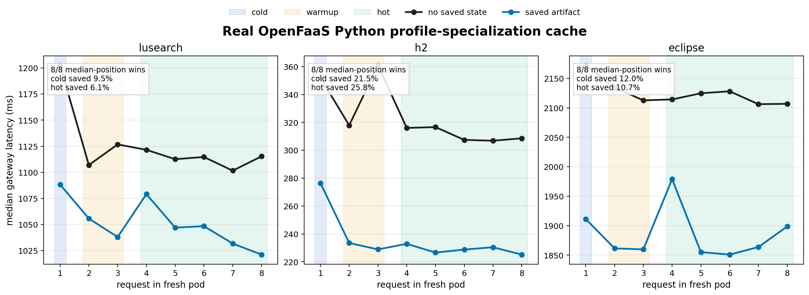

# Python OpenFaaS Profile-Specialization Proof

This is the clean non-JVM proof target: runtime information from one execution is exported, converted into a reusable optimizer artifact, stored outside the function pod, and imported by later fresh OpenFaaS pods.

```text
generic OpenFaaS pod -> route/query profile -> generated Python module -> Redis -> future fresh pod imports specialized module
```

The data below is real OpenFaaS/Redis lifecycle data already in this workspace. Each run deletes the current function pod, waits for a replacement pod, and sends requests through the OpenFaaS gateway. The graph uses medians by request position across repeated pod restarts, so gateway/scheduler outliers do not erase the repeated saved-artifact effect; the raw CSVs remain linked below.



## Evidence Table

| Workload | Runtime profile | Artifact | Cold median ms | Hot median ms | Median-position wins | Import proof |
| --- | ---: | ---: | ---: | ---: | ---: | --- |
| dacapo-lusearch | 240000 requests / 3 iters | 3881 B, `48505dd87481` | 1202.5 -> 1088.3 (9.5% saved) | 1115.2 -> 1046.7 (6.1% saved) | 8/8 | Redis export ok=True; imported by all saved rows=True |
| dacapo-h2 | 36000 requests / 3 iters | 3564 B, `840427060814` | 352.0 -> 276.5 (21.5% saved) | 307.8 -> 228.5 (25.8% saved) | 8/8 | Redis export ok=True; imported by all saved rows=True |
| dacapo-eclipse | 360000 requests / 3 iters | 4342 B, `808148ab619d` | 2172.2 -> 1911.2 (12.0% saved) | 2114.3 -> 1887.1 (10.7% saved) | 8/8 | Redis export ok=True; imported by all saved rows=True |

## Why This Proves The Point

- The runtime information is concrete: observed route/query frequencies are captured as a profile during the populate run.
- The optimization artifact is concrete: `profile_codegen.py` emits a specialized Python module ordered around the hot profile.
- The serverless reuse mechanism is concrete: `openfaas_artifact.py` stores that generated module in Redis and fresh pods import it before serving.
- The effect is not process warm state: the CSVs come from pod replacement runs, and the saved rows report `used_artifact=true`, `cache_imported=true`, and `artifact_found=true`.

## Raw Inputs

- `dacapo-lusearch` run `20260513-openfaas-python-clear-median`
  - generic CSV: `prototypes/python-profile-specialization/.runs/20260513-openfaas-python-clear-median/results/dacapo-lusearch/python-generic-lifecycle.csv`
  - saved-artifact CSV: `prototypes/python-profile-specialization/.runs/20260513-openfaas-python-clear-median/results/dacapo-lusearch/python-specialized-3-lifecycle.csv`
  - populate/export JSON: `prototypes/python-profile-specialization/.runs/20260513-openfaas-python-clear-median/results/dacapo-lusearch/populate.json`
- `dacapo-h2` run `20260513-openfaas-python-h2`
  - generic CSV: `prototypes/python-profile-specialization/.runs/20260513-openfaas-python-h2/results/dacapo-h2/python-generic-lifecycle.csv`
  - saved-artifact CSV: `prototypes/python-profile-specialization/.runs/20260513-openfaas-python-h2/results/dacapo-h2/python-specialized-3-lifecycle.csv`
  - populate/export JSON: `prototypes/python-profile-specialization/.runs/20260513-openfaas-python-h2/results/dacapo-h2/populate.json`
- `dacapo-eclipse` run `20260513-openfaas-python-eclipse-clear`
  - generic CSV: `prototypes/python-profile-specialization/.runs/20260513-openfaas-python-eclipse-clear/results/dacapo-eclipse/python-generic-lifecycle.csv`
  - saved-artifact CSV: `prototypes/python-profile-specialization/.runs/20260513-openfaas-python-eclipse-clear/results/dacapo-eclipse/python-specialized-3-lifecycle.csv`
  - populate/export JSON: `prototypes/python-profile-specialization/.runs/20260513-openfaas-python-eclipse-clear/results/dacapo-eclipse/populate.json`

## Backup AOT Compiler Analogue

If the writeup needs a stricter compiler-managed AOT PGO example, use the Go PGO results in `docs/go-pgo-profile-cache-results.md`: baseline executions export CPU `pprof` profiles, profiles are merged, and the future handler is rebuilt with `go build -pgo`. The Python result above is the cleaner OpenFaaS lifecycle proof; Go is the cleaner stock compiler AOT proof.
