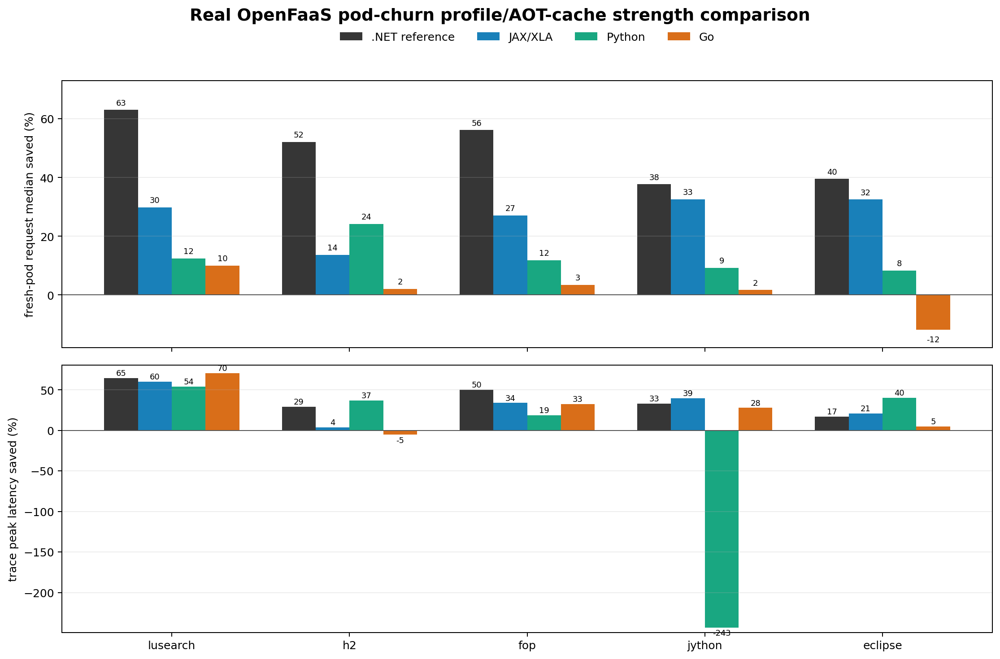
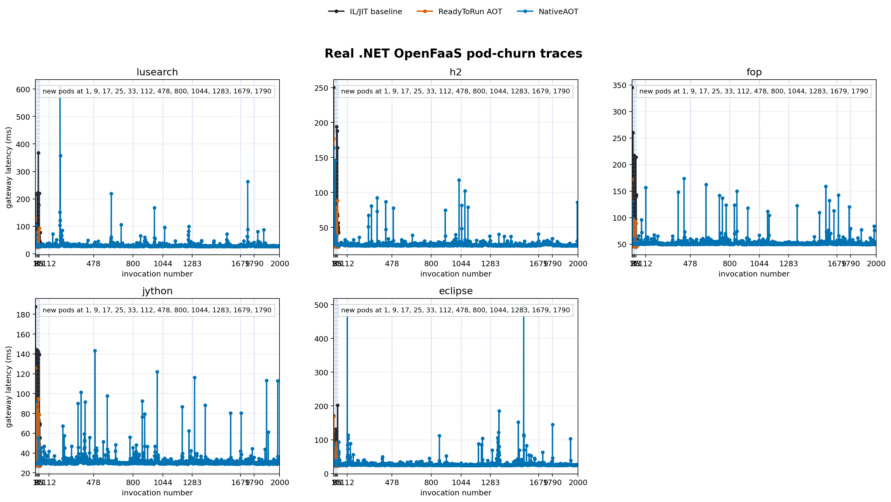
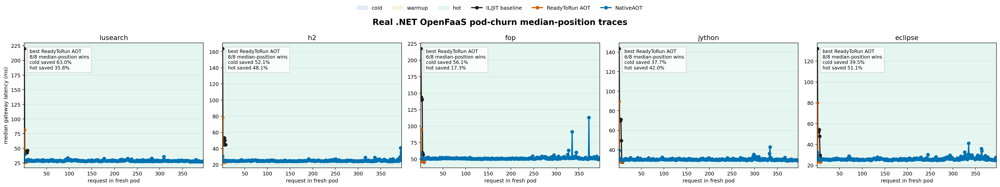
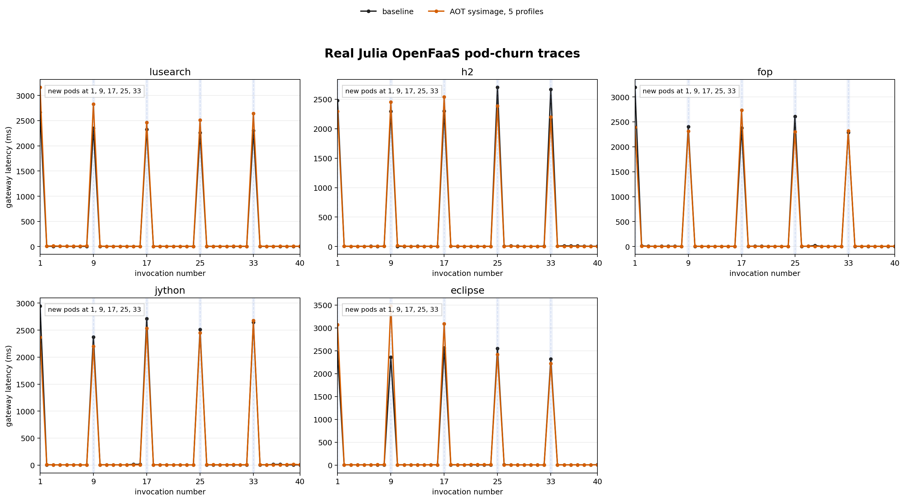
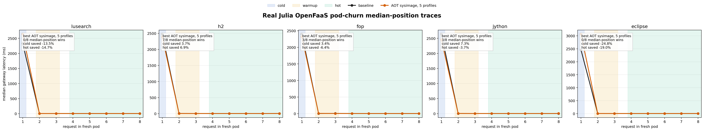

# Real Non-JVM OpenFaaS Pod-Churn Results

All numbers below come from real OpenFaaS/kind runs. No synthetic data is used
in this report.

## Best Current Domains

| Domain | Mechanism | Status |
| --- | --- | --- |
| .NET | IL/JIT baseline vs ReadyToRun AOT image; separate NativeAOT true compiler-AOT run | Strong AOT artifact control. NativeAOT is real compiler AOT, but it is not runtime-profile export/import. |
| JAX/XLA | runtime tensor signatures -> XLA persistent cache -> Redis artifact -> fresh pod import | Strong profile/artifact-cache analogue; compile/load p95 improves on all five workloads. |
| Python | runtime profile -> Redis specialization artifact -> fresh pod import | Real five-workload data; moderate median gains and several peak reductions, but not .NET-strength across all workloads. |
| Go | 5/10 runtime profile collection -> PGO rebuild -> fresh pod execution | Real five-workload profile-export/import loop; useful peak reductions on some workloads, weak median gains. |
| Julia | trace/profile-driven PackageCompiler sysimage | Real five-workload data, but mixed results; not a strong primary candidate yet. |

The UCLA modified JVM should stay as the reference/control for the expected
shape. The target domains here are non-JVM.

## Real Run Artifacts

| Domain | Raw data |
| --- | --- |
| .NET | `prototypes/dotnet-openfaas-readytorun/.runs/real-openfaas-pod-churn-dotnet-dacapo-20260517/results/` |
| .NET NativeAOT | `prototypes/dotnet-openfaas-readytorun/.runs/real-openfaas-pod-churn-dotnet-nativeaot-dacapo-20260518/results/` |
| Julia | `prototypes/julia-openfaas-redis-precompile/.runs/real-openfaas-pod-churn-julia-dacapo-workload-aot2-20260517/results/` |
| JAX/XLA | `prototypes/jax-openfaas-redis-xla/.runs/real-jax-xla-openfaas-pod-churn-five-20260518/results/` |
| Python | `prototypes/python-openfaas-redis-scale/.runs/real-python-openfaas-pod-churn-five-20260517/results/` |
| Go | `prototypes/go-openfaas-redis-pgo/.runs/real-go-openfaas-pod-churn-pgo-5-10-20260517/results/` |

Regenerate the figures from CSVs:

```bash
python3 scripts/plot_real_non_jvm_openfaas_results.py \
  --dotnet-nativeaot-results \
  prototypes/dotnet-openfaas-readytorun/.runs/real-openfaas-pod-churn-dotnet-nativeaot-dacapo-20260518/results
python3 scripts/plot_real_non_dotnet_strength_comparison.py
```

## Strength Against The .NET Reference

The graph below uses real OpenFaaS pod-churn CSVs only. It compares the .NET
ReadyToRun reference against the non-.NET domains on fresh-pod request median
savings and trace peak savings.



Summary: JAX/XLA is the strongest current non-.NET runtime-information cache.
It saves 13.7-32.5% on fresh-pod medians and up to 59.8% on trace peaks.
Python saves 8.3-24.2% on fresh-pod medians, but has a bad jython peak outlier.
Go PGO has real 5/10-profile rebuild data and suppresses some peaks, including
lusearch, but its fresh-pod median gains are small and one workload regresses.
None of the non-.NET candidates match the .NET ReadyToRun reference across all
five workloads.

## .NET: Strong AOT Artifact Baseline And NativeAOT

The real .NET five-workload run compares IL/JIT baseline against ReadyToRun AOT.
The separate NativeAOT run is a larger OpenFaaS trace with 2,000 invocations per
workload and fresh pods at invocations 1, 112, 478, 800, 1044, 1283, 1679, and
1790. NativeAOT is true compiler AOT, but it does not implement the
execution -> profile export -> profile import loop.





| Workload | Cold median IL -> R2R | Hot median IL -> R2R |
| --- | ---: | ---: |
| lusearch | 220.3 ms -> 81.5 ms | 43.1 ms -> 27.7 ms |
| h2 | 163.8 ms -> 78.5 ms | 45.0 ms -> 23.3 ms |
| fop | 217.7 ms -> 95.5 ms | 56.8 ms -> 47.0 ms |
| jython | 143.6 ms -> 89.5 ms | 49.4 ms -> 28.7 ms |
| eclipse | 132.1 ms -> 79.9 ms | 47.8 ms -> 23.3 ms |

NativeAOT large-trace results:

| Workload | Churn-request median | Hot median | All-request p50 | All-request p95 |
| --- | ---: | ---: | ---: | ---: |
| lusearch | 39.3 ms | 28.8 ms | 28.8 ms | 37.0 ms |
| h2 | 30.3 ms | 24.6 ms | 24.6 ms | 28.4 ms |
| fop | 59.1 ms | 50.7 ms | 50.7 ms | 56.8 ms |
| jython | 39.3 ms | 30.1 ms | 30.1 ms | 36.3 ms |
| eclipse | 32.4 ms | 25.6 ms | 25.6 ms | 32.9 ms |

.NET is the best non-JVM compiler-AOT control so far. It is not yet the full
execution -> profile export -> profile import loop, and NativeAOT mostly removes
JIT warmup instead of producing a JVM-like warmup curve.

## JAX/XLA: Runtime-Information Artifact Cache

This run uses five DaCapo-shaped tensor signatures:
`dacapo-lusearch`, `dacapo-h2`, `dacapo-fop`, `dacapo-jython`, and
`dacapo-eclipse`.

Loop:

```text
execution observes tensor shape/dtype/static args
-> JAX traces and XLA compiles
-> persistent compilation cache is exported to Redis
-> fresh OpenFaaS pod imports the artifact before first request
```


| Workload | Cold median baseline -> saved artifact | Compile/load p95 baseline -> saved artifact |
| --- | ---: | ---: |
| lusearch | 481.7 ms -> 337.8 ms | 106.8 ms -> 25.4 ms |
| h2 | 459.0 ms -> 396.1 ms | 111.3 ms -> 35.7 ms |
| fop | 470.0 ms -> 342.7 ms | 130.6 ms -> 29.9 ms |
| jython | 474.8 ms -> 320.3 ms | 128.4 ms -> 31.9 ms |
| eclipse | 488.8 ms -> 329.9 ms | 144.0 ms -> 25.6 ms |

This is the best current non-JVM profile/artifact-cache analogue because the
saved artifact is driven by runtime specialization inputs and reused by fresh
pods.

## Julia: Real But Mixed

The Julia run compares baseline JIT behavior against a PackageCompiler
`sysimage5` image built from profile/tracing runs.





| Workload | Cold median baseline -> sysimage5 | Hot median baseline -> sysimage5 |
| --- | ---: | ---: |
| lusearch | 2329.1 ms -> 2643.4 ms | 4.5 ms -> 5.2 ms |
| h2 | 2478.9 ms -> 2387.2 ms | 4.0 ms -> 3.8 ms |
| fop | 2401.8 ms -> 2319.0 ms | 3.6 ms -> 3.9 ms |
| jython | 2643.6 ms -> 2451.8 ms | 3.9 ms -> 4.1 ms |
| eclipse | 2459.7 ms -> 3069.1 ms | 6.2 ms -> 7.3 ms |

This is real profile-derived AOT/sysimage data, but the result is not strong
enough to be the main claim without more tuning.

## Current Conclusion

Use .NET as the strong non-JVM AOT artifact baseline/control. Use JAX/XLA as the
best current non-JVM domain that actually follows the runtime-information ->
compiled artifact -> fresh-pod-import pattern. Python and Go are real supporting
domains, but they are not as strong as the .NET graph on end-to-end fresh-pod
latency. Keep Julia as a real but negative/mixed result unless a stronger
sysimage profile set is produced.
